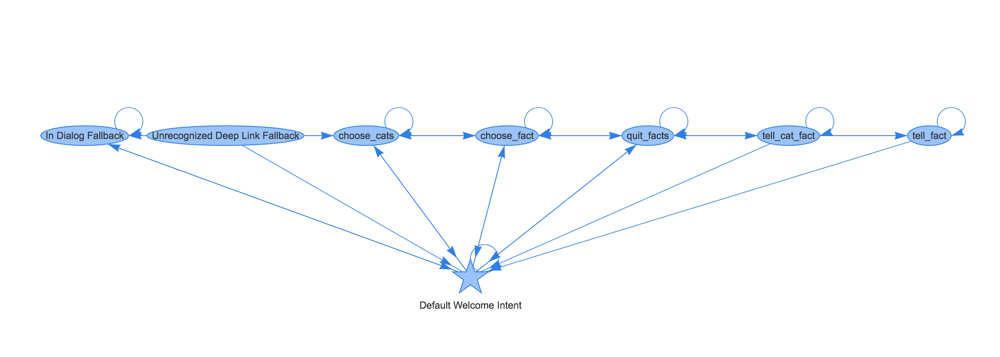

# Dialogflow Agent Visualization Tool	
When developing a Dialogflow agent, have you ever drawn a diagram of intents trying to create a good conversational experience for your app? I certainly have. I would later transform this hand-drawn diagram into a Dialogflow agent, hoping I didn’t make mistakes. What if there was a way to see how intents are connected in your Dialogflow agent? 

[](https://github.com/actions-on-google/dialogflow-facts-about-google-nodejs)

The Dialogflow Agent Visualization Tool, i.e. ```dfvis```, allows you to display your Dialogflow agent as an HTML rendered graph, where nodes are the intents and edges exists if it’s possible to go from intent A to intent B during a conversation.

**The software is currently in alpha**

# Limitations
* Works only with agents whose primary language is English
* Doesn’t properly connect nodes that set output context in a fulfillment webhook.

# How to get started
```dfvis``` is a command-line tool that you can install via NPM:

```npm install -g dfvis```

Then, 
```dfvis /path/to/dialogflow-agent-folder/ -o /path/to/output/file```

```dfvis``` takes a path to a folder containing Dialogflow agent that can be obtained from Dialogflow console by selecting “Import as ZIP”. Note, you will need to unzip the downloaded file. 

See full help message below,
```
$ dfvis -h
usage: dfvis [-h] [-v] [-o OUT] file

DialogFlow visualizing software

Positional arguments:
  file               Path to a folder with DialogFlow agent.

Optional arguments:
  -h, --help         Show this help message and exit.
  -v, --version      Show program's version number and exit.
  -o OUT, --out OUT  Name of the file where to redirect the output.
```

# How it works
The tool parses intents from ```agent/intents/``` folder of a Dialogflow ```agent```. Then, the graph is created where edge (A,B) exists between intent A and intent B if and only if one of the following cases is satisfied:
* B doesn’t have any input contexts
* Set of output contexts of A contains is a superset of input contexts of B

The resulted graph is then rendered into HTML using```vis.js``` (link)[http://visjs.org/] as the visualization engine. 

# Examples
See ```examples``` folder for generated HTML files for the following open-source samples:
* official Actions on Google sample (“Number Genie”)[https://github.com/actions-on-google/dialogflow-number-genie-nodejs]
* official Actions on Google sample (“Facts About Google”)[https://github.com/actions-on-google/dialogflow-facts-about-google-nodejs]

# License
This software is Copyright 2018, Aza Tulepbergenov, and available under MIT license (see LICENSE).

# Contributions
I welcome feedback and contributions. I tried to write code using well-known OO design patterns: Builder (building a graph), Strategy (generating edges between nodes in a graph) and Visitor (codegen). Hopefully, this will help the reader understand the code structure. 

# Report bugs
Please submit issues here.
